# Diy_RPC


- 更完整的协议设计
- spi 机制
- 动态可插拔的组件
- 方法级别的超时控制
- 各种重试策略
- 指数回避
- 多端限流
- 熔断降级

## [RPC 是什么?](#rpc-是什么)

RPC 是一种协议，允许程序调用位于远程服务器上的方法，就像调用本地方法一样。RPC 通常基于 Socket 通信实现。

常见的 RPC 框架包括：

1. gRPC：基于 HTTP/2 和 Protocol Buffers。
2. Dubbo：阿里开源的分布式 RPC 框架，适合微服务场景。
3. Spring Cloud OpenFeign：基于 REST 的轻量级 RPC 框架。
4. Thrift：Apache 的跨语言 RPC 框架，支持多语言代码生成。

> http 与 rpc 区别

| HTTP                       | RPC                            |
| -------------------------- | ------------------------------ |
| 协议                       | 架构                           |
| 性能较差                   | 性能好                         |
| 跨环境的数据传输和接口调用 | 内部网络个服务之间的高性能调用 |

**RPC 主要组成部分**

客户端+服务端+注册中心

**细分内容**

服务注册、服务发现、路由寻址、序列化、IO 模型等


## 1 简单 demo

```xml
<dependency>
    <groupId>io.netty</groupId>
    <artifactId>netty-all</artifactId>
    <version>4.1.128.Final</version>
</dependency>

<dependency>
    <groupId>org.projectlombok</groupId>
    <artifactId>lombok</artifactId>
    <version>1.18.42</version>
</dependency>
```

provider 调用自己的方法

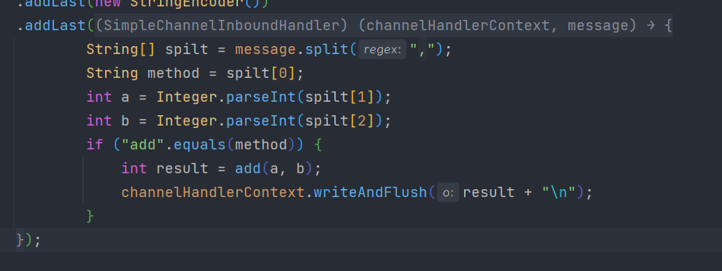

consumer

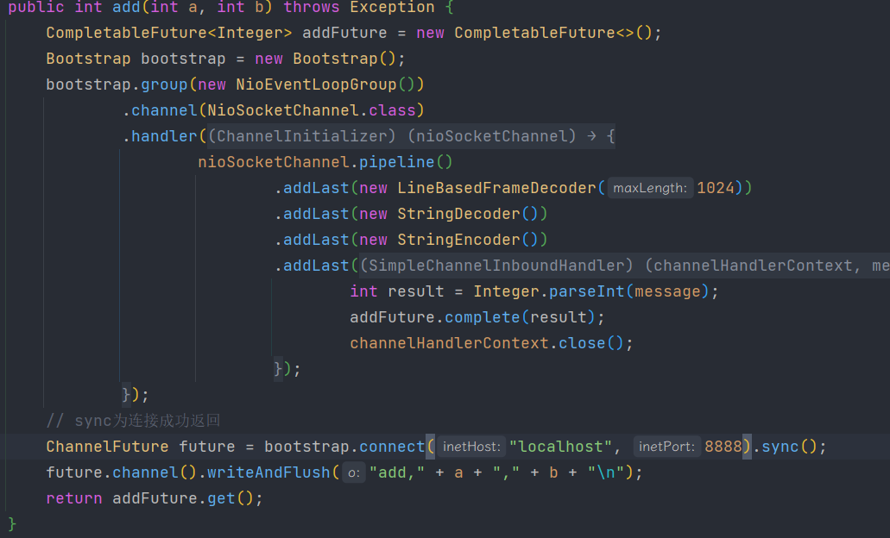

## 2 自定义协议简单通信

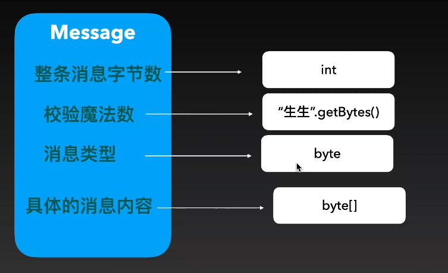

```java
@Data
public class Message {

    public static final byte[] MESSAGE_LOGIC = "生生".getBytes(StandardCharsets.UTF_8);

    /**
     * 魔数，用于校验协议消息
     **/
    private byte[] logic;

    /**
     * 消息类型
     * {@link MessageType}
     **/
    private byte messageType;

    /**
     * 消息体数据
     **/
    private byte[] body;


    public enum MessageType {
        /**
         * 请求消息
         **/
        REQUEST(1),
        /**
         * 响应消息
         **/
        RESPONSE(2);

        private final byte number;

        MessageType(int number) {
            this.number = (byte) number;
        }

        public byte getNumber() {
            return number;
        }
    }
}

```

基于定义自己的解码器 Decoder

- 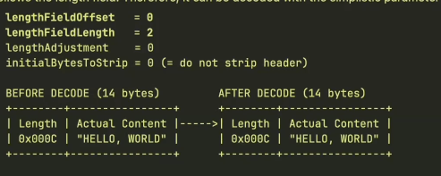
- 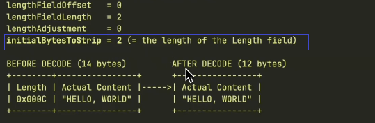

代码 SSDecoder

## 3 注册表，实现动态调用

注册表：哪些函数可以被调用

```java
// 假设有一个Add接口
public interface Add {
    Integer add(int a, int b);
}

// consumer实现Add接口-> 使用netty调用RPC
// provider方面要有AddImpl实现
public class AddImpl implements Add {
    @Override
    public Integer add(int a, int b) {
        return a + b;
    }
}
// 然后将接口与实现类注册到注册表中

package tech.insight.shegnsheng.rpc.provider;

public class ProviderRegistry {
    // 容器
    private Map<String, Invocation<?>> serviceInstanceMap = new ConcurrentHashMap<>();
    // 注册
    public <I> void register(Class<I> interfaceClass, I serviceInstance) {
        // 放到Map里，注意重复注册
    }
    // get
    public Invocation<?> findService(String serviceName) {
        return serviceInstanceMap.get(serviceName);
    }

    public static class Invocation<I> {

        final I serviceInstance; // 实现类
        final Class<I> interfaceClass; // 接口

        public Invocation(Class<I> interfaceClass, I serviceInstance) {
            this.interfaceClass = interfaceClass;
            this.serviceInstance = serviceInstance;
        }

        // 调用
        public Object invoke(String methodName, Class<?>[] paramsClass, Object[] params) {
            Method invokeMethod = interfaceClass.getDeclaredMethod(methodName, paramsClass);
            return invokeMethod.invoke(serviceInstance, params);
        }
    }
}

// Provider从注册表，取出服务 -> invoke -> 返回结果
```

## 4 健壮性-异常、重试、日志

### 1. 异常处理设计思路

视频讲解了在 RPC 远程调用过程中可能出现的各种异常情况，包括：

- 无法获取服务调用信息（invocation 为 null）
- 方法不存在等问题
- 方法调用过程中出现异常

核心原则：**不要将异常吞掉让客户端一直等待，而是将错误信息包装在 response 中返回给客户端**

### 2. Provider 端实现

**创建 ProviderHandler 类**

- 继承 `SimpleChannelInboundHandler<Request>`
- 将原有代码逻辑迁移到该类中，使启动代码更清爽

**重构 Response 协议**

- 增加 `code` 字段（200 表示成功，非 200 表示失败）
- 增加 `errorMessage` 字段用于存放错误信息

**添加 Response 工厂方法**

```java
// 失败响应
Response.fail(String message)  // code=400
// 成功响应
Response.success(Object result) // code=200
```

**异常捕获逻辑**

- 如果 `invocation == null`：返回"服务名没有对应处理服务"的错误
- 如果方法调用抛出异常：捕获异常并返回包含异常信息的失败响应
- 正常执行：返回成功响应

### 3. Consumer 端实现

**响应结果处理**

- 判断 `response.code == 200`：正常返回结果
- 判断失败：通过 `CompletableFuture.completeExceptionally()` 结束等待，并抛出 `RpcException`

**创建自定义异常**

- 新建 `RpcException` 类用于封装 RPC 调用异常

### 4. 超时机制实现

**问题场景**
Provider 端计算耗时过长（如 4 秒），Consumer 端会一直阻塞等待

**解决方案**

- 使用 `future.get(timeout, TimeUnit)` 替代普通 `get()`
- 示例：设置 3 秒超时 `future.get(3, TimeUnit.SECONDS)`
- 超时抛出 `TimeoutException`

### 5. 日志系统完善

**引入依赖**

- `logback-core` 和 `logback-classic`

**关键日志点**

- `channelActive()`：记录客户端连接日志（远程地址）
- `channelInactive()`：记录断开连接日志
- `exceptionCaught()`：捕获并记录不可知异常，关闭 channel
- 正常调用后：记录"函数被调用"日志（服务名、方法名、结果）

**异常处理策略**

- 编解码异常：直接断开 channel（说明协议不匹配）
- ProviderHandler 异常：已捕获并包装为失败响应，若仍有异常则记录日志并关闭 channel

### 6. 测试验证

- 故意传入错误方法名 → 客户端收到"类找不到"异常
- 修正后正常调用 → 成功返回
- Provider 阻塞 4 秒，Consumer 设置 3 秒超时 → 抛出超时异常

---

**核心收获**：通过完善的异常处理、超时机制和日志记录，使 RPC 框架更加健壮，便于问题排查。

## 5 连接管理器，在途请求维护

d54eaa9c 分支

### 1. 问题发现

当前实现的问题是**每次调用都新建连接**：

- 先建立连接 → 调用函数 → 断开连接
- 频繁建立/断开连接效率低下

**优化目标**：建立**长连接**，多次复用同一个 channel，最后统一关闭

### 2. 连接管理器（ConnectionManager）实现

**核心功能**：根据地址(host:port)返回 channel，屏蔽连接创建细节

**关键设计**：

- 使用 `ConcurrentHashMap<String, ChannelWrapper>` 维护连接池（key 为`host:port`）
- 使用 `computeIfAbsent`：key 不存在时才创建连接
- 使用 `ChannelWrapper` 包装类：解决 ConcurrentHashMap 不能存 null 值的问题

**连接状态管理**：

```java
// 1. channel关闭时自动从map移除
channel.closeFuture().addListener(future -> channelTable.remove(key));

// 2. 获取时检查channel是否活跃
if (channel == null || !channel.isActive()) {
    channelTable.remove(key);
    return null;
}
```

### 3. 请求-响应匹配机制

**问题**：长连接下多个请求并发，如何知道 response 对应哪个 request？

**解决方案**：

- **Request 增加 requestId**：使用 `AtomicInteger` 全局递增生成唯一 ID
- **Response 带回 requestId**：创建时传入对应 request 的 ID
- **维护"在途请求"表**：`ConcurrentHashMap<Integer, CompletableFuture<?>>`

**流程**：

1. 发送请求前：生成 requestId
2. 发送成功后：将 `future` 放入 `inFlightRequestTable`（key 为 requestId）
3. 收到响应后：根据 response 的 requestId 找到对应 future，完成或异常结束
4. 从 inFlightRequestTable 中移除该请求

### 4. Consumer 端改造

**简化后的调用流程**：

```java
// 1. 从连接管理器获取channel（复用或新建）
Channel channel = connectionManager.getChannel(host, port);
if (channel == null) throw new RpcException("连接失败");

// 2. 生成requestId并发送
request.setRequestId(counter.getAndIncrement());
channel.writeAndFlush(request).addListener(future -> {
    if (future.isSuccess()) {
        inFlightRequestTable.put(requestId, pendingFuture);
    }
});
```

**移除原有代码**：不再每次新建 bootstrap 和连接，改为使用 ConnectionManager

### 5. 测试结果

- 多次调用 add 函数，**只建立一次连接**
- 连接持续保持，直到程序结束才断开
- 请求-响应通过 requestId 正确匹配

---

**核心收获**：通过连接池管理实现长连接复用，通过 requestId 实现异步请求-响应的精确匹配，大幅提升 RPC 框架性能和可靠性。

## 6 用动态代理工厂创建消费者

这是一个关于 **Java RPC 框架开发** 的技术教程视频，主要讲解如何通过 **JDK 动态代理** 来优化和重构 RPC 消费者（Consumer）端的代码实现。

### 1. 响应处理的健壮性优化

- **问题**：当响应返回时，如果根据 request ID 找不到对应的请求，会得到 null，导致空指针异常
- **解决方案**：增加 null 判断，如果找不到对应的请求，记录警告日志并直接返回，避免程序崩溃

### 2. 代码重构与解耦

- 将 `CompletableFuture` 的泛型从具体类型改为 `Response`，提高代码复用性
- 将响应处理逻辑从匿名内部类中提取出来，使其与具体业务方法解耦，只与"在途请求"管理相关联

### 3. 动态代理实现 Consumer（核心内容）

**背景问题**：

- 每个 Consumer 都需要维护三个通用组件：在途请求管理器、连接管理器、Bootstrap
- 当接口增加新方法（如从 `add` 扩展到 `minus`）时，需要复制大量重复代码

**解决方案 - JDK 动态代理**：

- 创建 `ConsumerProxyFactory` 工厂类，统一管理三个核心组件（单例模式）
- 使用 `Proxy.newProxyInstance()` 创建代理对象：
  - **类加载器**：使用系统上下文类加载器
  - **接口数组**：传入目标接口（如 `Add.class`）
  - **InvocationHandler**：定义方法调用拦截逻辑

**InvocationHandler 的核心逻辑**：

1. **Object 方法拦截**：处理 `toString()`、`equals()`、`hashCode()`，其他 Object 方法（如 `wait`、`notify`）抛出 `UnsupportedOperationException`
2. **业务方法处理**：
   - 创建 `ResponseFuture`
   - 从连接管理器获取 Channel
   - 通过反射获取方法名、参数、参数类型、接口名（Service Name）构建 RPC 请求
   - 发送请求并等待响应
   - 返回响应结果

### 4. 验证与测试

- 创建 10 个代理对象，每个调用多次方法
- 验证结果：所有代理对象都能正确获取返回值，且**连接被复用**（只有一个物理连接），证明工厂模式和动态代理的有效性

### 5. 代码优化

- 将工厂类中的核心组件声明为 `final`
- 完善 `toString()` 方法，显示当前代理的接口类名

> 技术要点

| 概念                              | 说明                                                                     |
| --------------------------------- | ------------------------------------------------------------------------ |
| **在途请求 (In-flight requests)** | 管理已发送但未收到响应的 RPC 请求，用于匹配响应与请求                    |
| **JDK 动态代理**                  | 运行时生成代理类，拦截接口方法调用，实现通用逻辑模板                     |
| **连接复用**                      | 通过工厂模式维护单例的连接管理器，多个代理对象共享同一连接               |
| **模板方法模式**                  | 将 RPC 调用的通用流程（创建请求 → 发送 → 等待响应 → 返回结果）抽象为模板 |

> 最终架构优势

1. **解耦**：代理逻辑与具体业务接口完全解耦
2. **复用**：连接管理器、Bootstrap、在途请求管理器全局唯一，资源复用
3. **扩展性**：新增接口方法无需修改 Consumer 代码，自动通过反射支持
4. **简化**：开发者只需定义接口，通过工厂即可获取可用的代理对象，无需手动实现 Consumer

这段代码实现了一个简化版的 **Dubbo/MyBatis** 风格的 RPC 消费者端代理机制。

## 7 实现注册中心

根据您提供的完整视频字幕内容，这是一个关于**RPC（远程过程调用）框架开发**的技术教学视频，重点讲解了**服务注册与发现**的实现，特别是如何利用 **ZooKeeper** 作为注册中心。

### 1. 面临的问题（视频开头部分）

1.  **硬编码问题**：Consumer（服务消费者）直接写死了 Provider（服务提供者）的地址（如 `localhost:8888`），缺乏灵活性。
2.  **Provider 动态性**：
    - Provider 可能有多个实例（如 8888, 8889, 8890）。
    - Provider 可能扩容、缩容或下线。
    - Consumer 无法感知 Provider 的变化，可能导致请求失败。

---

### 2. 解决方案：引入注册中心 (Service Registry)

视频提出了核心概念：需要一个中间组件来解耦 Consumer 和 Provider。

1.  **核心思想**：
    - Provider 启动时，将自己的服务信息（地址、端口、服务名）**注册**到注册中心。
    - Consumer 需要调用服务时，从注册中心**查询**可用的 Provider 列表。
    - 当 Provider 状态变化（上/下线）时，注册中心需要**通知**Consumer。
2.  **注册中心的核心功能要求**：
    - **数据存储**：能保存服务信息。
    - **通知机制**：当服务节点变化时，能主动通知 Consumer。
    - **数据一致性**（对集群化注册中心尤为重要）：确保所有 Consumer 看到的信息是一致的。
    - **心跳/临时节点**：能自动感知 Provider 是否存活（例如通过心跳机制，节点断开后自动删除）。

---

### 3. 技术选型：为什么选择 ZooKeeper

视频探讨了多种可作为注册中心的组件（如 MySQL, Redis, etcd, Nacos, ZooKeeper），并最终选择 **ZooKeeper** 作为本系列视频的实现。

- **ZooKeeper 的优势**：
  - 它天然支持**树形结构**的节点（ZNode），非常适合组织服务目录（如 `/ss/rpc/serviceName/providerAddress`）。
  - 支持**临时节点 (Ephemeral Node)**：当客户端（Provider）会话断开后，节点自动删除，完美实现了服务**自动下线**的感知。
  - 提供**监听机制 (Watch)**：客户端可以监听节点的变化，从而实现**服务变更通知**。
  - 保证了**顺序一致性**和**最终一致性**。

---

### 4. 实战开发：集成 ZooKeeper 到 RPC 框架

这部分是视频的实操核心，分步骤展示了如何编码实现。

1.  **定义核心接口与模型**：

    - `ServiceRegister`：注册中心通用接口，定义了 `registerService` 和 `fetchServiceList` 方法。
    - `ServiceMetadata`：服务元数据类，包含 `host`, `port`, `serviceName` 等信息。

2.  **引入并配置 ZooKeeper 客户端**：

    - 使用 Apache **Curator** 框架（一个对 ZooKeeper 原生 API 进行封装的客户端），因为它更易用。
    - 特别是使用 `curator-x-discovery` 包，它直接提供了**服务发现**的高级抽象。

3.  **Provider 端实现服务注册**：

    - 在 `ProviderServer` 启动并成功绑定端口后，遍历本地已注册的所有服务。
    - 为每个服务创建一个 `ServiceMetadata` 对象（包含当前主机、端口、服务名）。
    - 调用 `ServiceRegister.registerService` 方法，将元数据注册到 ZooKeeper（底层由 Curator 创建临时节点）。

4.  **Consumer 端实现服务发现与调用**：

    - 在 `ConsumerProxyFactory` 中持有 `ServiceRegister` 实例。
    - 当发起 RPC 调用时，先通过 `fetchServiceList` 根据服务接口名（如 `com.example.AddService`）从注册中心获取可用的 Provider 列表。
    - 从列表中选取一个 Provider（视频中简单取了第一个，后续可扩展为负载均衡）。
    - 使用获取到的 `host` 和 `port` 发起真正的网络请求，从而**消除了硬编码**。

5.  **处理注册中心故障：引入本地缓存**：
    - **发现问题**：当 ZooKeeper 注册中心本身宕机时，Consumer 将无法查询任何服务，导致整个系统不可用。
    - **解决方案**：设计了一个**装饰器模式**的 `DefaultServiceRegister`。
      - 它内部封装了具体的注册中心实现（如 `ZooKeeperServiceRegister`）。
      - 在 `fetchServiceList` 时：
        - 如果底层注册中心调用成功，则**更新本地缓存**并返回结果。
        - 如果底层注册中心调用失败（如网络异常），则**降级返回本地缓存**中的历史数据，保证服务**暂时可用**，提高了系统的鲁棒性。

---

### 5. 演示与验证

视频最后通过一个完整的 Demo 验证了功能：

1.  **服务注册**：启动 Provider，在 ZooKeeper 可视化工具中看到对应的临时节点被创建。
2.  **服务发现**：启动 Consumer，成功调用 Provider 的服务。
3.  **Provider 动态上下线**：
    - 关闭旧的 Provider（端口 8888），等待其 ZooKeeper 临时节点过期消失。
    - 启动新的 Provider（端口 8887）。
    - Consumer 在后续的调用中，自动从注册中心拉取到新的 Provider 地址（8887），并成功切换连接。期间会有短暂的失败重试。
4.  **注册中心故障容错**：
    - 在 Consumer 持续调用过程中，主动关闭 ZooKeeper。
    - Consumer 会先经历客户端重试（Curator 的指数退避重试策略）。
    - 重试失败后，触发异常，降级到使用本地缓存的服务地址，**请求恢复成功**。
    - 重新启动 ZooKeeper 后，系统恢复正常。

---

### 6. 关键技术与设计模式总结

- **设计模式**：接口抽象、装饰器模式（缓存）、工厂模式（创建不同注册中心实例）。
- **核心技术**：ZooKeeper、Curator 框架、临时节点与监听机制、服务元数据模型、客户端缓存降级策略。
- **核心价值**：实现了服务的**解耦**、**动态发现**和**故障容错**，是微服务架构的核心基础设施。

## 8 重构代码，解决小 bug

### 1. 注册中心重构 (00:00-00:14)

- 将 `register` 重命名为 `registry`，使用更通用的专业术语

---

### 2. 消费者端重构 (00:14-03:43)

- **抽取 InvocationHandler**：将 Consumer Factory 中的 InvocationHandler 逻辑抽取为独立的 `ConsumerInvocationHandler` 类
- **方法拆分**：将长方法拆分为多个小方法：
  - `invokeObjectMethod()`：处理 Object 类定义的方法（如 toString、equals 等）
  - `buildRequest()`：封装创建请求的逻辑
  - `processResponse()`：处理响应的逻辑
- **配置化改造**：创建 `ConsumerProperties` 配置类，包含：
  - `workThreadNumber`：工作线程数（默认 4）
  - `connectTimeoutMs`：连接超时时间（默认 3 秒）
  - `requestTimeoutMs`：请求超时时间（默认 3 秒）
  - 注册中心配置

---

### 3. 协议修正 (03:43-03:59)

- 将消息中的 `logic`（魔术）修正为 `magic`

---

### 4. 服务提供者重构 (03:59-08:02)

- 创建 `ProviderProperties` 配置类，包含：
  - 注册中心配置
  - `host`：服务地址
  - `port`：服务端口
  - `workThreadNumber`：工作线程数
- 重构 `ProviderServer`，通过配置类初始化

---

### 5. 日志增强 (08:02-09:19)

- 将服务端的日志处理逻辑复制到消费者端
- 抽取 `ConsumerHandler` 类，继承 `SimpleChannelInboundHandler`
- 使消费者也能看到连接信息

---

### 6. Netty 内存管理优化 (09:19-13:10)

- **ByteBuf 内存泄漏问题**：Netty 的 ByteBuf 使用直接内存，不受 JVM GC 管理
- **引用计数机制**：
  - 每个 ByteBuf 维护引用计数
  - 调用 `release()` 方法减少引用计数
  - 计数为 0 时回收内存
- **代码优化**：在解码器中增加 `try-finally` 块，确保使用完 frame 后调用 `release()` 释放内存
- **解释**：为什么 JVM 不用引用计数（循环引用问题），而 Netty 可以用（pipeline 中无循环引用）

---

### 总结

这次重构主要提升了代码的可维护性和清晰度，通过配置化使框架更灵活，同时修复了潜在的内存泄漏问题。

## 9 负载均衡

### 1. 问题背景

- 在之前的实现中，Consumer（消费者）从注册中心获取 Provider（服务提供者）列表后，**总是固定调用第一个服务**
- 这会导致：
  - 某一台 Provider 负载过高（被"压榨"）
  - 其他 Provider 空闲，造成资源浪费
- **解决方案**：引入负载均衡策略，将请求分散到各个 Provider

### 2. 负载均衡接口设计

- 创建 `LoadBalancer`（负载均衡器）接口
- 核心方法：`select(List<ServiceMetadata> metadataList)`
  - 输入：服务元数据列表
  - 输出：选中的一个服务元数据
- 扩展性：可传入上下文（Context）包含方法名等信息，实现更精细的路由策略

### 3. 两种经典负载均衡策略实现

| 策略                    | 实现方式                                                                           |
| ----------------------- | ---------------------------------------------------------------------------------- |
| **轮询（Round Robin）** | 使用 `AtomicInteger` 维护索引，每次 `getAndIncrement()` 后对列表长度取模，循环选择 |
| **随机（Random）**      | 使用 `Random.nextInt(size)` 随机选择列表中的一个服务                               |

### 4. 配置与集成

- 在 `ConsumerConfig` 中增加负载均衡策略配置（字符串类型，默认"轮询"）
- 在 `ConsumerFactory` 中增加创建负载均衡器的工厂方法：
  - 根据配置字符串（"round_robin" 或 "random"）返回对应实例
  - 不支持时抛出异常
- 修改 `ConsumerInvocationHandler`，通过构造函数注入负载均衡器
- 调用时从 `metadataList.get(0)` 改为 `loadBalancer.select(metadataList)`

### 5. 测试验证

- 启动两个 Provider 实例（端口 8888 和 8887）
- 启动 Consumer，每秒发送一次请求
- 验证结果：请求交替发送到 8888 和 8887，实现了负载均衡

### 技术要点

- 使用 `AtomicInteger` 保证轮询的线程安全
- 使用 `Math.abs()` 防止索引溢出为负数
- 预留了扩展接口，支持基于方法名等上下文的智能路由

## 10 重试

https://chat.qwen.ai/c/bfaa68fc-ba50-4c16-93af-11f2e68230cd

### (1) 问题背景（00:00-01:02）

讲师首先指出了 RPC 调用中简单超时处理的两个**片面性**：

1. **网络抖动问题**：如果某个 Provider 只是瞬间连接不上（如 1 秒），直接报错过于严格，应该允许重试
2. **超时粒度问题**：不应该只有请求超时（如 3 秒），还应该有**函数级超时**（如 30 秒）。即使单次请求超时，只要函数总时间未超，仍可重试

---

### (2) 重试策略的核心设计（01:02-03:06）

提出需要设计**重试策略接口（Retry Policy）**，并列举了四种典型重试类型：

| 策略类型       | 说明                                       |
| -------------- | ------------------------------------------ |
| **Retry Same** | 向同一个失败的 Provider 重新发送请求       |
| **Failover**   | 换一个 Provider 进行连接                   |
| **Forking**    | 向多个 Provider 同时发送请求，任一成功即可 |
| **Broadcast**  | 向所有 Provider 广播请求                   |

**核心挑战**：如何将异步的、强耦合的发送请求代码解耦，封装成可供重试策略调用的异步函数。

---

### (3) 异步调用封装（03:06-07:55）

讲师实现了`callRpcAsync`方法，关键设计：

- 返回`CompletableFuture<Response>`实现异步
- 使用**时间轮（HashedWheelTimer）**替代 EventLoop 处理超时任务，避免压榨 IO 线程
- 设置两层超时：**请求超时**（短）和**自动过期时间**（长，给缓冲时间）

---

### (4) 重试上下文（Retry Context）（07:55-13:20）

构建了重试所需的上下文信息：

- 上次失败的 Provider
- 所有可用 Provider 列表
- 负载均衡器
- 剩余超时时间计算（函数级超时 - 已消耗时间）
- 发送请求的函数式接口（Lambda）

---

### (5) 具体策略实现（13:20-36:10）

#### 1. Retry Same（同节点重试）

- 向同一 Provider 重新请求
- 支持**最大重试次数**（默认 3 次）
- **指数退避（Exponential Backoff）**：间隔时间按 2 的幂次增长（100ms→200ms→400ms...），并加入随机扰动避免**重试风暴**
- 每次重试前检查函数剩余超时时间

#### 2. Failover（故障转移）

- 失败后从其他 Provider 中选一个重试
- 使用负载均衡策略从剔除失败节点后的列表中选择

#### 3. Forking（多路并发）

- 向所有其他 Provider 并发发送请求
- 使用`CompletableFuture.anyOf()`，任一返回即成功
- 适用于对延迟敏感、需要快速得到响应的场景

---

### (6) 测试验证（25:01-36:10）

通过启动多个 Provider（部分故意设置 4 秒延迟超时）验证：

- **Retry Same**：第一次超时后，重试到正常节点成功
- **Failover**：8887 超时后，自动切换到正常的 8888
- **Forking**：并发请求多个 Provider，只要有一个正常返回即成功

---

### (7) 核心要点

1. **超时分层**：请求超时 ≠ 函数超时，后者是前者的兜底
2. **异步解耦**：通过 Future 和函数式接口将调用逻辑与重试逻辑分离
3. **退避策略**：指数退避+随机扰动防止重试风暴
4. **时间轮优化**：用 HashedWheelTimer 专门处理超时任务，减轻 EventLoop 负担

## 11 限流

### (1) 限流组件的实现

> 为什么需要限流

- **目的**：防止服务器在同一时刻接收到过多请求而导致崩溃。
- **作用对象**：
  - **服务提供者（Provider）**：保护自身不被过载压垮。
  - **服务消费者（Consumer）**：限制自身过于频繁地请求提供者，实现本地快速失败，避免无效的网络通信。

> 限流的设计思路

- **核心机制**：类似于 Java 并发包（JUC）中的信号量。
  - 在发送请求（Consumer）或调用函数（Provider）前，先尝试从限流器中**获取一个凭证**。
  - 如果获取成功，则继续执行后续逻辑；如果获取失败，则**快速失败**（直接返回错误），不阻塞线程。
- **接口定义**：
  - `tryAcquire()`：尝试获取凭证，无论成功或失败都立即返回结果。
  - `release()`：归还凭证。

> 限流的两大分支

==并发限流==

- **定义**：限制服务器能够同时处理的请求数量（即最大并发数）。
- **特点**：
  - 如果并发数达到上限（如 100 个），第 101 个请求无论等多久，只要前面的请求未完成，都会被拒绝。
  - 类似于线程池的阻塞队列满了之后触发拒绝策略。
- **实现**：
  - 可以直接使用 JUC 包中的 `Semaphore`（信号量）来实现。
  - `tryAcquire` 对应 `semaphore.tryAcquire()`。
  - `release` 对应 `semaphore.release()`。

==速率限流==

- **定义**：限制在**单位时间内**（如每秒）允许通过的请求数量。
- **特点**：
  - 用于防止流量突然激增（如反爬虫、热点事件）。
  - 例如：限制每秒 100 个请求，那么这一秒的第 101 个请求会被拒绝，但下一秒又可以接收新的 100 个请求。
- **实现演进**：
  1.  **令牌桶（定时任务版）**：
      - 通过一个定时任务，每秒刷新一次令牌桶的数量。
      - **问题**：存在临界点问题。例如在 0.9 秒到 1 秒之间，可能会出现瞬间流量超出限流阈值的情况，导致限流不够平滑。
  2.  **平滑限流（事件驱动版）**：
      - **思想**：变定时扫描为事件驱动，只有在尝试获取凭证时才进行计算。
      - **算法**：
        - 根据每秒允许的并发数，计算出每次请求的**最小时间间隔**。
        - 记录下一次允许获取令牌的时间戳。
        - 每次请求时，比较当前时间与下一次允许的时间。
        - 如果当前时间晚于下次允许时间，则通过 CAS 操作更新下次允许时间（当前时间 + 间隔），并返回成功。
        - 否则，返回失败或根据配置进行有限次数的重试。

> 限流在服务端的应用策略

- **服务提供者（Provider）**：
  - **全局限流（并发限流）**：限制整个 Provider 实例的最大承载并发量。
  - **局部限流（速率限流）**：可以对特定的 Consumer 进行限制（如每个 Consumer 每秒最多 10 个请求），或者限制整个 Provider 的请求速率。
- **服务消费者（Consumer）**：
  - 所有请求都是自己主动发起的，限流的主要目的是为了保护 Provider。
  - 通常只需要在本地进行**速率限流**，一旦触发限流，无需网络通信即可快速失败。

### (2) Consumer 限流

Consumer 端基于“在途请求数量”的限流实现。

==核心实现==：

1.  **封装管理器**：创建 `InFlightRequestManager`，统一管理请求注册、超时定时任务（时间轮）及限流逻辑。
2.  **双重限流**：
    - **全局限流**：控制所有 Consumer 的总在途请求并发数。（基于 semaphore 实现全局一共能承受多少流量）
    - **通道限流**：基于 `ServerMetaData` 控制单个 Provider 连接的请求并发数。
      - RateLimiter，先计算每个令牌的 intervalNs，如一个令牌 200ns
      - 获取当前时间 → 比较下次令牌时间 → CAS 更新 → 成功返回 true，失败重试，512 次后返回 false。
3.  **流程控制**：发送前 acquire 许可，请求完成/超时/异常后 release 许可并回调 Future。
4.  **异常处理**：定义 `LimitException`，捕获后禁止重试。

==验证结果==：
并发测试触发限流生效；多 Provider 场景下，结合负载均衡与限流策略有效保护服务端。

### (3) provider 限流

> 提供者端限流的必要性

- 在`provider`端，需要在处理每次请求时进行拦截，以防止服务过载。

> 限流处理器的位置与设计

- **Pipeline 位置**：限流`handler`必须位于业务处理器（`provider handler`）之前，在编解码之后执行拦截。
- **双向处理器**：由于请求是入站（Inbound）的，而响应是出站（Outbound）的，为了在响应写回时释放限流资源，限流`handler`需要继承`ChannelDuplexHandler`，使其成为一个既能处理入站又能处理出站的双向处理器。
- **核心逻辑**：
  - **读事件**：收到请求时，尝试获取限流许可。如果获取成功，调用`ctx.fireChannelRead(msg)`将请求向后传播；如果失败，直接写回一个限流错误的响应。
  - **写事件**：当业务处理器写回响应时，在`write`方法中为写入操作添加监听器。无论写入成功与否，在操作完成后都需要释放之前获取的限流许可。

> 限流策略的实现

- **双重限流**：实现了两种粒度的限流：
  - **全局并发限流**：限制整个服务提供者同时处理的请求总数（例如最大 10 个请求）。
  - **单连接限流**：针对每个`Channel`（即每个消费者连接）进行限流。
- **资源绑定**：利用 Netty 的`Channel`属性（`AttributeKey`）将每个连接对应的限流器绑定到`Channel`上，方便在请求处理时获取。

> 许可的申请与释放

- **申请**：在`channelRead`中，先尝试获取全局许可，再获取`Channel`级别的许可。如果都成功，则记录已获取的全局许可数量（使用`AtomicInteger`）。
- **释放**：
  - 在`write`方法的监听器中，对全局和`Channel`级别的许可进行释放。
  - **连接关闭兜底**：重写`channelInactive`方法。当连接断开时，检查该连接剩余的未释放许可，并将其归还给全局限流器，防止资源泄漏。这需要一个支持释放指定数量许可的`release(int permits)`方法。

> 消费者端的清理

- **无需归还许可**：消费者端的限流许可由请求的超时时间轮负责兜底释放，因此不需要手动归还。
- **清理待处理请求**：当消费者的一个连接关闭时，需要清理与该连接相关的、正在等待响应的请求（`inflight request`）。
- **实现**：在连接管理器中，为`Channel`添加一个关闭监听器。当连接关闭时，调用`inflightRequestManager`的清理方法，移除该连接对应的元数据，避免内存泄漏。

## 12 熔断

这是一个关于 **RPC 框架中熔断器（Circuit Breaker）机制** 的教学视频，讲解了如何在 Java 中实现一个完整的熔断器组件。

方法级别的熔断

---

### 1. 熔断器的背景与动机

- **问题场景**：RPC 调用默认等待 3 秒，但某些 provider 虽然未超时（如 2 秒响应），却远超预期（1 秒），说明其性能下降或网络异常。
- **解决方案**：引入熔断器，对异常状态的 provider 暂停请求，待其恢复后再尝试。

---

### 2. 熔断器的工作原理

- **Closed（闭合）**：正常状态，允许请求通过
- **Open（打开）**：熔断状态，拒绝请求
- **Half-Open（半开）**：试探状态，允许少量请求测试服务是否恢复

```
Closed --(慢请求超标)--> Open --(熔断时间到)--> Half-Open
   ↑                                              |
   └--------(试探成功)-----------------------------┘
              (试探失败则回到Open)
```

---

### 3. 核心组件设计

> **CircuitBreaker 接口**

定义两个核心方法：

- `allowRequest()`：判断是否允许当前请求发送（布尔值）。
- `recordRpc(RpcCallMetrics metrics)`：记录 RPC 调用结果（成功、失败、耗时、异常等）。

> **RpcCallMetrics 监控指标类**

记录 RPC 调用的完整信息：

- `complete`：是否成功完成
- `throwable`：异常信息
- `duration`：调用耗时
- `methodName`、`provider`、`args`：调用的方法、目标 provider、参数等

封装了 `complete()` 和 `errorComplete(Throwable)` 方法，自动计算耗时。

> **CircuitBreakerManager 管理器**

- 维护 `Map<ServiceMetadata, CircuitBreaker>`，为每个 provider 独立管理熔断器。
- 提供 `createOrGetBreaker()` 方法，使用 `computeIfAbsent` 实现线程安全的懒加载。

### 4. 集成到 RPC 调用流程

> **调用前检查（Decide Provider）**

- 在 `ConsumerFactory` 中创建 `CircuitBreakerManager`。
- 抽取 `decideProvider(List<ServiceMetadata> candidates)` 方法：
  - 循环使用负载均衡器选择 provider。
  - 检查其熔断器是否允许请求。
  - **允许**：返回该 provider。
  - **拒绝**：从候选列表移除，继续选择下一个。
  - **无可用**：抛出异常 "没有可以提供服务的 provider"。

> **调用后记录**

- 创建 `RpcCallMetrics` 实例，标记开始时间。
- RPC 结束后（成功或异常），调用 `metrics.complete()` 或 `metrics.errorComplete()`。
- 通过 `breaker.recordRpc(metrics)` 将指标记录到熔断器。

> **重试策略的透明封装**

- 为保证重试策略代码不变，但又能记录每次重试的指标：
  - 将 `doRpc` 函数包装成 Lambda，在内部嵌入熔断器检查逻辑。
  - **熔断时**：直接返回 `CompletableFuture.failedFuture(new RpcException("provider熔断了"))`，实现快速失败，无需真正发送请求。
  - **未熔断时**：执行真实 RPC，并通过 `whenComplete` 回调记录指标到熔断器。

---

### 5. 关键设计要点

- **线程安全**：所有组件（Manager、Breaker）必须保证线程安全。
- **透明性**：熔断和记录逻辑对上层（如重试策略）完全透明，不侵入业务代码。
- **性能优化**：熔断后直接快速失败，避免等待超时；通过修改候选列表实现高效的 provider 筛选。

### 关键技术实现

#### 滑动窗口统计

使用**环形数组（Circular Array）**实现时间窗口：

- 窗口时长：10 秒，分为 10 个 slot（每秒一个）
- 每个 slot 记录：总请求数、异常/慢请求数
- 通过取模运算实现环形覆盖，始终统计最近 10 秒数据

#### 线程安全设计

- 状态变更使用 `AtomicReference` + CAS 操作
- 窗口滑动使用 `ReentrantLock` 保护
- 关键变量标记 `volatile` 保证可见性

#### 熔断触发条件

- **慢请求阈值**：响应时间超过配置值（如 2 秒）
- **熔断比例**：慢请求占比超过阈值（如 30%）
- **最小样本数**：避免样本过少时误触发（如至少 5 个请求）

#### 代码结构

```
ResponseTimeCircuitBreaker
├── State（枚举：OPEN/CLOSED/HALF_OPEN）
├── 环形数组窗口（10个slot）
├── 核心方法：
│   ├── canRequest()：判断是否允许发送请求
│   ├── recordRPC()：记录RPC调用结果
│   └── 状态机处理：processOpen/Closed/HalfOpen()
└── 配置参数：熔断时长、慢请求阈值、触发比例等
```

#### 实际效果演示

视频中启动了两个 Provider（一个正常、一个慢响应），Consumer 以负载均衡方式调用。当慢 Provider 的响应时间超过阈值后：

1. 被自动熔断，请求不再发往该节点
2. 熔断时间结束后进入半开状态，发送试探请求
3. 试探失败则再次熔断，成功则恢复闭合状态

这是一个典型的**响应时间熔断器**的完整实现，结合了滑动窗口统计和状态机模式，在生产环境中可有效防止故障扩散。

## 13 降级

**核心目标**：实现 RPC 客户端重试失败后的降级兜底机制。

**关键组件**：

1.  **Fallback 接口**：定义 `fallback()` 返回兜底结果，`record()` 记录成功响应。
2.  **缓存降级**：成功时缓存结果，失败时返回缓存。使用特殊对象区分真实 null 值。
3.  **Mock 降级**：通过 `@RpcFallback` 注解指定本地实现类，反射调用该方法作为兜底。
4.  **组合策略**：优先尝试缓存，失败则尝试 Mock。

**流程整合**：

- 主流程 Retry 异常后触发 fallback。
- 正常响应后触发 record 更新缓存。

**测试与修复**：

- 验证关闭 Provider 后缓存生效。
- 验证无缓存时 Mock 生效。
- 修复缓存 null 值语义混淆及注解获取位置（应从声明类获取）的 Bug。

---

### 1. 降级的基本概念

- **触发条件**：当 `invoke` 经过重试等算法或 provider 始终获取不到后仍然抛出异常，客户端会进入降级流程。
- **核心思想**：远程调用失败后，退而求其次，采用本地计算或缓存数据来返回结果，避免服务不可用。

---

### 2. 降级组件的设计

视频中设计了两个主要的降级策略，并通过一个组合模式（`DefaultFallback`）进行统一管理：

- **接口定义 （`RpcFallback`）**：

  - 定义了降级的核心方法 `fallback（RpcCallMatrix matrix）`，根据调用信息返回一个结果对象。
  - 定义了一个默认的 `record（RpcCallMatrix matrix）` 方法，用于在成功调用时记录信息（主要用于缓存），子类可按需实现。

- **组合降级 （`DefaultFallback`）**：
  - 内部组合了 `CacheFallback`（缓存降级）和 `MockFallback`（ Mock 降级）。
  - 在 `fallback` 时，优先尝试缓存降级；如果缓存降级失败（抛出异常），则转而执行 Mock 降级。
  - 在 `record` 时，会调用内部所有组件的 `record` 方法，确保成功调用的结果被缓存。

---

### 3. 缓存降级的实现

- **缓存存储**：使用 `ConcurrentHashMap` 存储调用结果。Key 是一个自定义的 `InvokeKey`（包含 `Method` 和参数 `args`），Value 是返回的结果对象。
- **Null 值处理**：由于 `ConcurrentHashMap` 不能存储 `null` 值，定义了一个静态的 `NULL_OBJECT` 常量来代表 `null` 结果。存入时如果结果为 `null` 则替换为 `NULL_OBJECT`；取出时如果为 `NULL_OBJECT` 则返回 `null`。
- **记录 （`record`）**：在 RPC 调用成功时，将 `method`、`args` 和 `result` 组装成键值对存入缓存。
- **降级 （`fallback`）**：根据传入的 `matrix` 生成 `InvokeKey`，从缓存中查找结果。如果找不到，则抛出异常，表示缓存降级无效，需要交给 Mock 降级处理。
- **局限性提及**：提到了缓存无限制增长的缺点，以及引入过期时间或 LRU 算法的必要性（但未深入实现）。

---

### 4. Mock 降级的实现

- **用户侧注解 （`@RpcFallback`）**：

  - 定义了一个注解，允许用户在服务接口的方法上指定一个本地实现类。
  - `@Target（ElementType.TYPE）` 表明注解用在类上。
  - `@Retention（RetentionPolicy.RUNTIME）` 确保运行时可以通过反射获取。
  - 包含一个 `value（）` 属性，用于指定降级时使用的本地实现类的 `Class` 对象。

- **Mock 对象的创建与管理**：
  - **校验**：首先检查方法所在类上是否有 `@RpcFallback` 注解，以及注解中指定的本地实现类是否实现了当前接口。
  - **缓存**：为了避免每次降级都通过反射创建新对象，使用 `ConcurrentHashMap<Class, Object>` 对创建好的 Mock 对象进行缓存（`mockObjectCache`）。
  - **实例化**：通过 `Class` 的 `newInstance（）` 调用无参构造方法来创建 Mock 对象。同时提到未来可以与 Spring 集成，改为从容器中获取 Bean。
- **降级 （`fallback`）**：从缓存中获取（或创建）Mock 对象后，利用反射调用 `Method.invoke（mockObject, args）`，将结果返回。

---

### 5. 主流程集成

- **全局策略**：在 `Consumer` 启动时，初始化一个 `DefaultFallback` 实例，组合了 `CacheFallback` 和 `MockFallback`。
- **异常捕获**：将原来的重试和主调用逻辑放入 `try-catch` 块中。
- **降级调用**：在 `catch` 块中，调用 `fallback.fallback（matrix）` 获取降级结果。
- **成功记录**：在调用成功后（`complete` 方法中），调用 `fallback.record（matrix, response）` 将结果存入缓存。
- **Provider 不可用场景测试**：
  - 当 Provider 启动后关闭，由于缓存中存在历史数据，Consumer 能继续返回缓存值（3）。
  - 当 Provider 从未启动时，缓存为空，缓存降级抛出异常，触发 Mock 降级，最终返回本地 Mock 实现中定义的值（0）。

---

### 6. 关键代码调整与 Bug 修复

- **缓存 Null 的判断逻辑**：修复了缓存未命中时错误返回 `null` 的问题，改为抛出异常，以便流转到 Mock 降级。
- **注解获取位置**：修复了 Mock 降级中从 `method` 获取注解的错误，改为从 `method.getDeclaringClass（）` 获取类上的注解，确保能正确读到用户配置的降级类。

## 14 序列化和压缩组件

==Message 字段==

```java
// 添加
// 版本
private short version;

// 序列化（前四位）和压缩算法（后四位）放在一起，程序启动时从配置信息获取，此后的序列化工作都按照此策略
private byte serializeAndCompress;
```

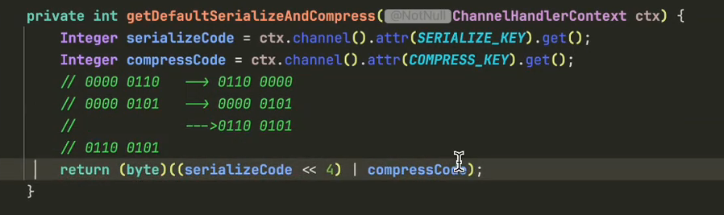

==Request 和 Response 序列化==

**原本方案**：

1. fastjson
2. RequestEncoder 和 ResponseEncoder 的 encode 逻辑一样，只是类型不同

**改进**：

1. 抽象出一个通用的 Encoder
   1. 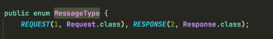
   2. 创建 Serializer 接口，根据配置信息来决定使用什么方法
   3. chanelAtive 时，在 ctx 上下文中将`序列化器及其管理器`放进去

==body 压缩(Compress)==

**原本方案**：消息体最多 1M

**改进**：压缩 body，减小带宽

1. 提供解压缩方法
2. 使用 Gzip 压缩算法
   1. 在消息 size 小的时候效果差，反而变大了
3. 同样放入 ctx 上下文

```java
@Override
public byte[] compress(byte[] bytes) {
    try (ByteArrayOutputStream bos = new ByteArrayOutputStream();
         GZIPOutputStream gzip = new GZIPOutputStream(bos)) {
         gzip.write(bytes);
         gzip.finish();
        return bos.toByteArray();
    } catch (Exception e) {
        throw new RpcException("压缩过程失败", e);
    }
}

@Override
public byte[] decompress(byte[] bytes) {
    try (ByteArrayOutputStream bos = new ByteArrayOutputStream();
         GZIPInputStream gzip = new GZIPInputStream(new ByteArrayInputStream(bytes))) {

        byte[] buffer = new byte[4096];
        int len;
        while ((len = gzip.read(buffer)) != -1) {
            bos.write(buffer, 0, len);
        }
        return bos.toByteArray();
    } catch (Exception e) {
        throw new RpcException("解压缩过程失败", e);
    }
}
```

## 15 心跳和载荷流量统计

### 心跳

> 功能

心跳的第一个功能是**维持连接**，防止网络设备（如路由器、防火墙）因长时间无数据交互而自动断开连接。

就是我们建立连接的两端，每隔一段时间向对方发生一条心跳消息

---

心跳的第二个功能是**主动探测网络状态**。

当客户端与服务端连接后服务端突然宕机，客户端在没有发送业务数据时是无法感知的。通过心跳消息主动探测网络，可以快速检测出服务端不可用，而不必等到真正发送业务数据时才发现。

> 什么时候发送

Netty 提供了 **IdleStateHandler** 来监控“多久没有读写数据”。

我们可以配置一个时间，当连接空闲（即多久没有收到数据或多久没有写出数据）超过这个时间时，就会触发一个事件，从而让我们有机会发送心跳或处理超时。

**IdleStateHandler** 的三个核心参数（按顺序）：

1.  **`readerIdleTime`**：读空闲时间
    - 多久没有**收到**数据，就会触发读空闲事件。
2.  **`writerIdleTime`**：写空闲时间
    - 多久没有**写出**数据，就会触发写空闲事件。
3.  **`allIdleTime`**：读写空闲时间
    - 多久既没有收到也没有写出数据，就会触发读写空闲事件。

单位通常为秒。当超过设定时间时，会触发 `IdleStateEvent`，你可以在 `userEventTriggered()` 方法中处理这个事件（如发送心跳）。

> 怎么做

这段代码实现了**双向心跳检测**的逻辑，分为两部分：

处理接收到的消息（`channelRead0`）

- **收到心跳请求**：立即返回心跳响应（带上请求时间戳）
- **收到心跳响应**：计算延迟时间并打印（监控网络状况）
- **其他消息**：传递给下一个处理器

处理空闲事件（`userEventTriggered`）

- **读空闲**（服务端用）：长时间没收到客户端数据，直接关闭连接（释放资源）
- **写空闲**（客户端用）：长时间没发送数据，主动发一个心跳请求（探测连接是否存活）

核心逻辑总结

- **客户端**：写空闲时发心跳，收到响应后统计延迟
- **服务端**：读空闲时关闭连接（认为客户端已死），收到心跳就回响应

根据代码逻辑来看：

- **心跳请求（`HeartbeatRequest`）**：由**客户端**发出
- **心跳响应（`HeartbeatResponse`）**：由**服务端**发出

**判断依据**：

1.  `WRITER_IDLE`（写空闲）触发时发送的是 `HeartbeatRequest`——这通常是客户端的逻辑
2.  收到 `HeartbeatRequest` 时立即返回 `HeartbeatResponse`——这是服务端的逻辑

**总结**：

- **客户端**：主动发心跳请求
- **服务端**：被动回心跳响应

### 流量统计

在整个 pipeline 最前面添加一个统计功能（双向），这个 handler 每 5 秒打印一次当前这个程序上下行流量是多少@TrafficRecordHandler

> 关键逻辑

1. **流量采集**

   - `channelRead`: 拦截入站 `ByteBuf`，累加到 `download` 计数器
   - `write`: 拦截出站 `ByteBuf`，累加到 `upload` 计数器

2. **生命周期管理** (`channelActive`)

   - 初始化 `TrafficRecord` 对象
   - 启动定时任务：每 5 秒打印一次上行/下行流量
   - 将记录绑定到 Channel 属性：`ctx.channel().attr(RECORD_ATTRIBUTE_KEY).set(trafficRecord)`

3. **线程安全**
   - 使用 `AtomicLong` 保证计数原子性
   - 定时任务在 Channel 的 `eventLoop` 中执行，避免并发问题

> 使用方式

其他 Handler 可通过以下方式获取流量数据：

```java
TrafficRecord record = ctx.channel().attr(TrafficRecordHandler.RECORD_ATTRIBUTE_KEY).get();
long upload = record.upload.get();
long download = record.download.get();
```

> ⚠️ 注意：仅统计 `ByteBuf` 类型消息，其他类型消息会被忽略。

## 16 业务线程池保证读写吞吐量

**核心问题**：Consumer 长耗时调用阻塞 Provider 其他请求。

**原理分析**：

1.  **执行流**：Provider Handler 接收请求后，调用 invoke 执行业务。
2.  **阻塞点**：长耗时业务阻塞了 netty worker 线程。
3.  **架构影响**：该线程复用管理多个 Channel 及 Event Loop。
4.  **后果**：Event Loop 被占，无法处理其他请求，导致服务卡顿。

**对应概念**：Netty `NioEventLoop` 线程。

**工作原理**：

1.  **IO 复用**：单线程轮询处理多个 Channel 的读写事件。
2.  **任务执行**：默认在当前 IO 线程同步执行业务逻辑。

**阻塞影响**：
耗时操作阻塞事件循环，导致该线程绑定的所有连接无法响应。

**优化方案**：
耗时业务异步化，提交至独立业务线程池执行。

## 17 SPI 动态组件

### 1. 问题背景

视频首先提出了一个框架设计中的常见问题：当框架内置了固定的组件（如重试策略 `RetryPolicy`）时，**使用框架的用户无法在不修改源码的情况下自定义和注入新的组件实现**。例如，框架内部写死了 `retrySame` 和 `failover` 两种策略，用户无法实现自己的策略并注册到框架中。

---

### 2. 传统解决方案 vs SPI 方案

- **传统方式**：在 `ConsumerFactory` 中提供 `register` 方法，让用户手动注册实现类。缺点是每增加一个组件都需要手动注册一次，较为繁琐。
- **SPI 方式**：通过约定配置文件的位置（如 `META-INF/services/`），让框架自动扫描并加载用户自定义的实现类，实现**真正的解耦和插件化**。

---

### 3. JDK SPI 机制详解

视频详细介绍了 Java 标准 SPI 的使用方法：

- **配置位置**：在 `META-INF/services/` 目录下创建以接口全限定名命名的文件（如 `com.xxx.RetryPolicy`）。
- **文件内容**：写入实现类的全限定类名，多个实现类换行分隔。
- **加载方式**：使用 `ServiceLoader.load(Interface.class)` 获取迭代器，遍历得到所有实现类实例。
- **演示**：现场编写了 `MyRetryPolicy` 和 `MyRetryPolicy1`，通过 SPI 机制成功被加载并打印了构造函数中的日志。

---

### 4. 重构 RPC 框架组件

视频以实际代码重构展示了如何将 SPI 应用到框架的各个组件中：

> 方案一：接口方式（Extension 接口）

- 定义一个 `Extension` 接口，要求实现类提供 `getName()` 和 `getCode()` 方法。
- **序列化管理器重构**：
  - 删除硬编码的 `SerializerType` 枚举。
  - 在初始化时通过 `ServiceLoader` 加载所有 `Serializer` 实现。
  - 建立 `code -> serializer` 和 `name -> serializer` 两个映射表。
  - 增加校验逻辑：code 不能超过 15，且 code 和 name 不能重复。
  - 支持通过 name（字符串）或 code（整数）获取序列化器。

> 方案二：注解方式（@SPI 注解）

- 定义 `@SPI` 注解，包含 `value`（name）和 `code` 属性。
- **压缩器重构**：
  - 最初尝试用注解方式（`@SPI(name="gzip", code=1)`）标记实现类。
  - 在 `CompressionManager` 中通过反射读取注解信息完成注册。
  - **遇到的问题**：在 `Encoder` 中需要获取压缩器的 code，如果纯用注解，需要通过反射获取，较为繁琐。
  - **最终方案**：让 `Compression` 接口也继承 `Extension` 接口，与序列化器保持一致，直接调用方法获取元数据，避免反射。

---

### 5. 重试策略的重构

- 创建 `RetryManager`，同样使用 SPI 机制加载所有 `RetryPolicy` 实现。
- 删除 `ConsumerProxyFactory` 中硬编码的 `if-else` 判断逻辑。
- 通过 `RetryManager.getRetryPolicy(name)` 动态获取策略。
- 为 `FailoverRetryPolicy`、`RetrySamePolicy` 等实现类添加 `@SPI` 注解。

---

### 6. 验证与总结

- 删除不再需要的 `SerializableType` 和 `CompressionType` 等硬编码枚举类。
- 修改 `Consumer` 和 `Provider` 的初始化逻辑，改为从 Manager 获取组件。
- **启动测试**：成功启动 Provider 和 Consumer，每秒发送请求，验证重构后的框架仍能正常工作。

---

### 核心要点

| 概念             | 说明                                                                                                          |
| ---------------- | ------------------------------------------------------------------------------------------------------------- |
| **SPI 本质**     | 一种**服务发现机制**，通过配置文件实现接口与实现的解耦。                                                      |
| **JDK SPI 规范** | 配置文件位于 `META-INF/services/`，文件名为接口全限定名，内容为实现类全限定名。                               |
| **框架扩展性**   | 用户只需在依赖中引入自定义实现类并按约定配置，无需修改框架源码即可扩展功能。                                  |
| **两种实现方式** | 1. 接口约定（`Extension`）：实现类实现方法提供元数据。<br>2. 注解约定（`@SPI`）：通过反射读取注解获取元数据。 |

视频最终展示了一个**可插拔的 RPC 框架架构**，序列化器、压缩器、重试策略等核心组件都可通过 SPI 机制动态加载，极大提升了框架的灵活性和可扩展性。

## 18 泛化调用

### 核心问题

在标准 RPC 调用中，消费者需要依赖服务提供者的接口定义包。但在**网关(Gateway)**场景下，网关作为中间代理，无法预先知道所有服务的接口定义，因此需要一种不依赖具体接口类的调用方式。

### 解决方案：泛化调用

通过字符串参数动态指定调用信息，无需接口类定义：

#### 1. 接口定义

定义 `GenericConsumer` 接口，提供 `$invoke` 方法：

```java
Object $invoke(String serviceName, String methodName,
               String[] paramTypes, Object[] args)
```

- `$` 前缀用于区分普通方法，避免命名冲突
- `paramTypes` 使用字符串数组而非 `Class[]`，因为网关可能没有对应类

#### 2. 消费者端实现

- 在代理工厂中判断方法名是否为 `$invoke`
- 动态构建 `RpcRequest`，标记为泛化调用
- 参数类型和值从传入的数组中提取

#### 3. 复杂对象处理

- **传输约定**：自定义对象以 `Map` 形式传递（如 `{"name":"张三", "age":1}`）
- 序列化后传输，服务端反序列化为 `Map` 或 `JSONObject`

#### 4. 服务端实现

- **参数解析**：将字符串类名转换为 `Class`（需处理基本类型如 `int`）
- **对象转换**：使用 `JSON.toJavaObject()` 将 `Map` 转为目标类型
- **返回值处理**：自定义对象返回时转换为 `Map`，基本类型直接返回

### 关键代码逻辑

| 环节         | 普通调用                     | 泛化调用                  |
| ------------ | ---------------------------- | ------------------------- |
| Service 名称 | 接口类名                     | 参数第 0 个（字符串）     |
| 方法名       | `method.getName()`           | 参数第 1 个（字符串）     |
| 参数类型     | `method.getParameterTypes()` | 参数第 2 个（字符串数组） |
| 参数值       | 直接传入                     | 参数第 3 个（对象数组）   |
| 自定义对象   | 直接序列化                   | 转为 `Map` 传输           |

### 验证结果

成功实现三种调用：

1. 普通 RPC 调用：`add(1,2)` → 返回 `3`
2. 泛化调用基础类型：`$invoke(service, "add", ["int","int"], [4,5])` → 返回 `9`
3. 泛化调用自定义对象：传递 `User` 的 `Map` 表示，服务端解析后计算并返回 `Map`

## 流程总结

```
┌─────────────────────────────────────────────────────────────────────────────┐
│                            ConsumerApp 执行流程                              │
└─────────────────────────────────────────────────────────────────────────────┘

┌─────────────────────────────────────────────────────────────────────────────┐
│ 1. 配置初始化                                                                │
├─────────────────────────────────────────────────────────────────────────────┤
│  ┌──────────────────┐    ┌─────────────────────┐                            │
│  │  RegistryConfig  │───▶│ ConsumerProperties  │                           │
│  │  - zookeeper     │    │  - hessian          │                            │
│  │  - 127.0.0.1     │    │  - robin            │                            │
│  └──────────────────┘    └─────────────────────┘                            │
└─────────────────────────────────────────────────────────────────────────────┘
                                    │
                                    ▼
┌─────────────────────────────────────────────────────────────────────────────┐
│ 2. ConsumerProxyFactory 初始化                                               │
├─────────────────────────────────────────────────────────────────────────────┤
│  ┌─────────────────────────┐  ┌──────────────────┐  ┌──────────────────┐    │
│  │  DefaultServiceRegistry │  │ConnectionManager │  │CircuitBreakerMgr │ 	  │
│  │  (Zookeeper Client)     │  │ (Netty Client)   │  │ (熔断器)          │    │
│  └─────────────────────────┘  └──────────────────┘  └──────────────────┘    │
│  ┌─────────────────────────┐  ┌──────────────────┐                          │
│  │  InFlightRequestManager │  │ RetryPolicyMgr   │                          │
│  │  (限流 + 超时管理)       │  │ (重试策略)        │                          │
│  └─────────────────────────┘  └──────────────────┘                          │
└─────────────────────────────────────────────────────────────────────────────┘
                                    │
                                    ▼
┌─────────────────────────────────────────────────────────────────────────────┐
│ 3. 创建代理对象                                                              │
├─────────────────────────────────────────────────────────────────────────────┤
│  ┌──────────────────────────────────────────────────────────────────────┐   │
│  │ Proxy.newProxyInstance()                                             │   │
│  │                                                                      │   │
│  │  ┌──────────────────────────────────────────────────────────────┐    │   │
│  │  │ ConsumerInvocationHandler                                     │   │   │
│  │  │  - LoadBalancer (RoundRobin/Random)                           │   │   │
│  │  │  - RetryPolicy (Forking/Failover)                             │   │   │
│  │  │  - Fallback (Cache/Mock)                                      │   │   │
│  │  └──────────────────────────────────────────────────────────────┘    │   │
│  └──────────────────────────────────────────────────────────────────────┘   │
└─────────────────────────────────────────────────────────────────────────────┘
                                    │
                                    ▼
┌─────────────────────────────────────────────────────────────────────────────┐
│ 4. RPC 调用流程                                                              │
├─────────────────────────────────────────────────────────────────────────────┤
│                                                                      │      │
│  ① 从注册中心获取服务提供者列表                                         │      │
│     Zookeeper: /rpc/UserService/192.168.1.1:8080                      │      │
│                 /rpc/UserService/192.168.1.2:8080                     │      │
│                        │                                              │      │
│                        ▼                                              │      │
│  ② 负载均衡选择服务提供者                                               │      │
│     ┌─────────────────────────────────────────────────────┐           │      │
│     │ RoundRobin: 轮询选择                                  │          │      │
│     │ Random: 随机选择                                       │         │      │
│     └─────────────────────────────────────────────────────┘           │      │
│                        │                                              │      │
│                        ▼                                              │      │
│  ③ 限流检查（全局限流 + 通道限流）                                      │      │
│     ┌─────────────────────────────────────────────────────┐          │      │
│     │ globalLimiter: 每秒 100 请求                         │          |      │
│     │ channelLimiter: 每通道 50 并发                       │          │      │
│     └─────────────────────────────────────────────────────┘          │      │
│                        │                                             │      │
│                        ▼                                             │      │
│  ④ 获取 Netty 连接通道                                                │      │
│     ┌─────────────────────────────────────────────────────┐          │      │
│     │ Bootstrap.connect(host, port)                        │         │      │
│     │  - ChannelPipeline 编码/解码                          │         │      │
│     │  - SSEncoder: 序列化(Hessian) + 压缩                  │         │      │
│     │  - SSDecoder: 解压 + 反序列化                         │         │      │
│     └─────────────────────────────────────────────────────┘          │      │
│                        │                                             │      │
│                        ▼                                             │      │
│  ⑤ 发送 RPC 请求                                                      │      │
│     channel.writeAndFlush(request)                                   │      │
│                                                                      │      │
└─────────────────────────────────────────────────────────────────────────────┘
                                    │
                                    ▼
┌─────────────────────────────────────────────────────────────────────────────┐
│ 5. 服务端处理                                                                │
├─────────────────────────────────────────────────────────────────────────────┤
│                                                                      │      │
│  ProviderServer                                                      │      │
│    │                                                                 │      │
│    ├── LimitHandler (限流)                                           │      │
│    │                                                                 │      │
│    ├── ProviderHandler (业务处理)                                     │      │
│    │   │                                                             │      │
│    │   ├── 查找服务: registry.findService(serviceName)                │      │
│    │   │                                                             │      │
│    │   ├── 提交线程池: invokeExecutor.execute()                       │      │
│    │   │                                                             │      │
│    │   └── 反射调用: invocation.invoke(methodName, params)            │      │
│    │                                                                 │      │
│    └── 返回响应: Response.success(result, requestId)                  │      │
│                                                                      │      │
└─────────────────────────────────────────────────────────────────────────────┘
                                    │
                                    ▼
┌─────────────────────────────────────────────────────────────────────────────┐
│ 6. 消费者接收响应                                                            │
├─────────────────────────────────────────────────────────────────────────────┤
│                                                                      │      │
│  ConsumerHandler.channelRead0()                                      │      │
│    │                                                                 │      │
│    ├── SSDecoder 解码响应                                             │      │
│    │   ├── 解压: compression.decompress()                             │      │
│    │   └── 反序列化: serializer.deserialize()                         │      │
│    │                                                                 │      │
│    ├── InFlightRequestManager.completeRequest()                      │      │
│    │   └── future.complete(response)                                 │      │
│    │                                                                 │      │
│    └── ConsumerInvocationHandler 获得结果                             │      │
│        │                                                             │      │
│        ├── 熔断器记录: breaker.recordRpc(metrics)                     │      │
│        │                                                             │      │
│        └── 返回结果: processResponse(response)                        │      │
│                                                                      │      │
└─────────────────────────────────────────────────────────────────────────────┘
                                    │
                                    ▼
┌─────────────────────────────────────────────────────────────────────────────┐
│ 7. 异常处理与重试                                                            │
├─────────────────────────────────────────────────────────────────────────────┤
│                                                                      │      │
│  如果调用失败:                                                        │      │
│    │                                                                 │      │
│    ├── 熔断器记录失败: breaker.recordRpc(metrics)                     │      │
│    │                                                                 │      │
│    ├── 重试策略执行: retryPolicy.retry()                              |      │
│    │   ├── ForkingRetryPolicy: 并行广播                               │      │
│    │   └── FailoverRetryPolicy: 失败转移                              │      │
│    │                                                                 │      │
│    └── 降级处理: fallback.fallback()                                  │      │
│        ├── CacheFallback: 缓存降级                                    │      │
│        └── MockFallback: Mock 降级                                   │      │
│                                                                      │      │
└─────────────────────────────────────────────────────────────────────────────┘
```

> 图 1：配置初始化 + Factory 初始化

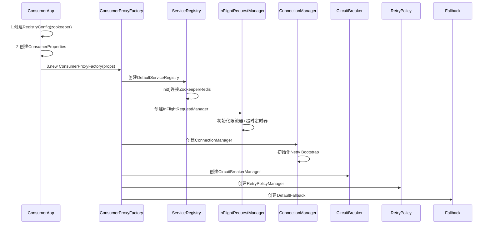

> 图 2：创建代理对象

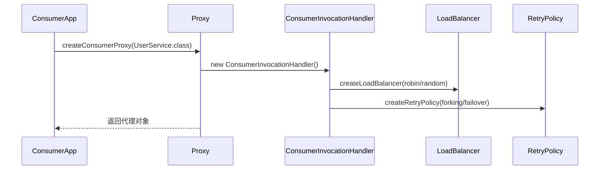

> 图 3：服务发现与负载均衡

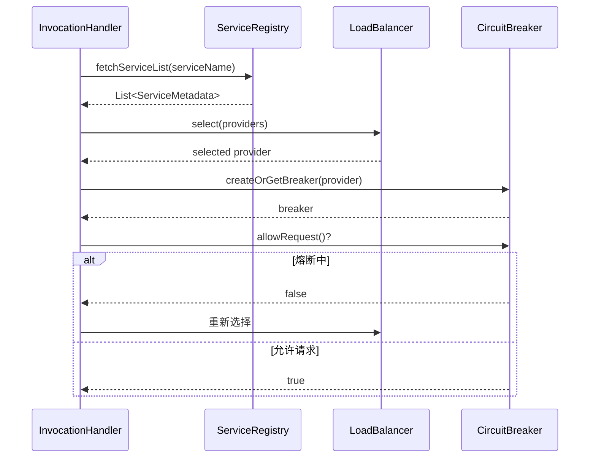

> 图 4：限流检查与获取连接

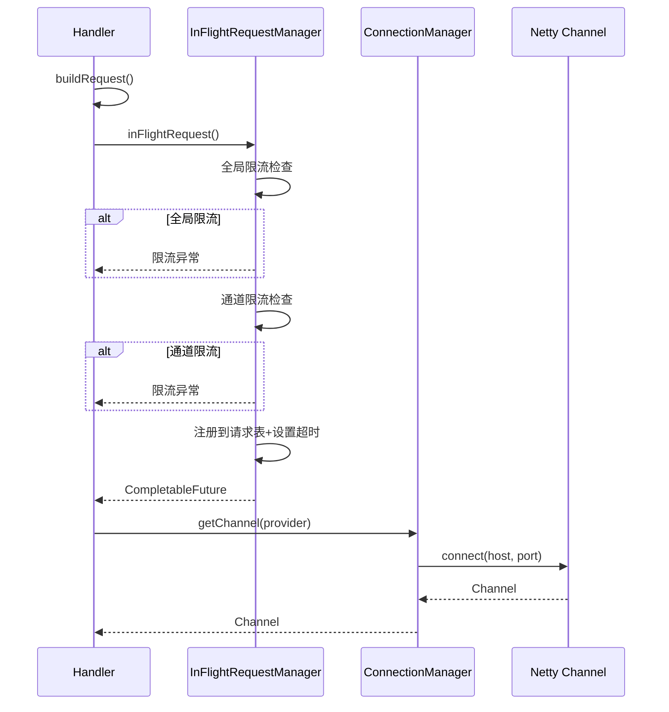

> 图 5：请求编码与发送

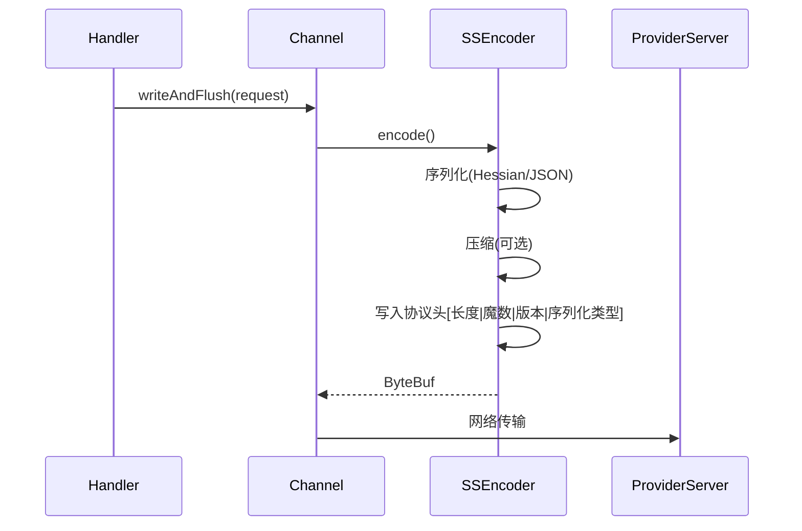

> 图 6：服务端处理

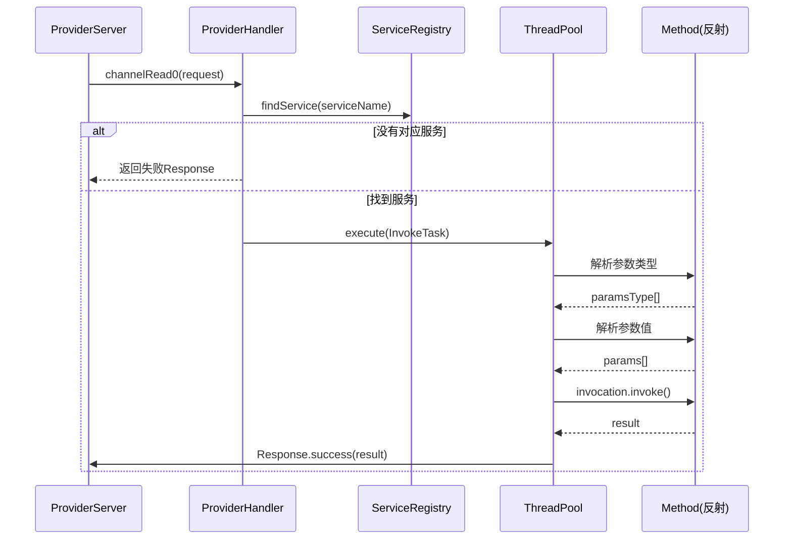

> 图 7：响应接收与处理

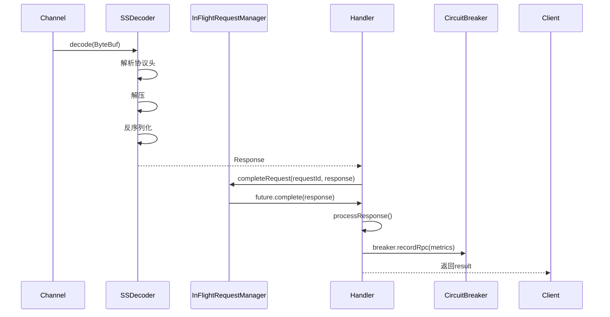

> 图 8：重试与降级

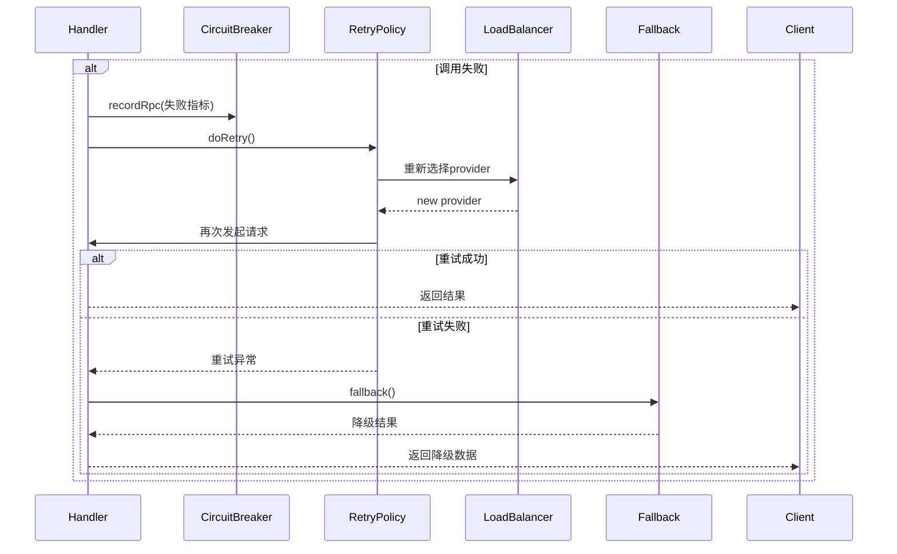
